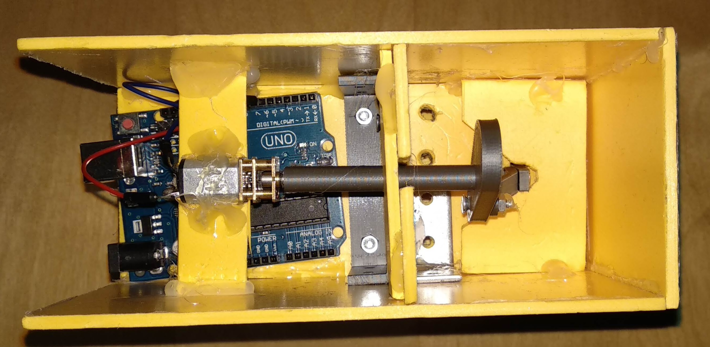

# Arduino Sewing Machine

## Description

This repository contains the **documentation**, **code** and **3D models** for creating a
_do-it-yourself_ **sewing machine** using Arduino, some hobyglass and a 3D printer.

The objectives were to understand how the mechanism behind a real sewing machine
works, to recreate it using 3D printing and easily available components, and eventually
to add smart features to the sewing machine.

### Video

### Table of contents

- [Models and designs](#models)
- [GIFs of Mechanisms](#mechanism)
- [Assembled hardware](#hardware)
- [Code](#code)
- [About](#about)

## Models

- [Interior Mechanism](models/SewingMachineMeasured.f3d)
  

- [Case](models/carcasa.step)
  
  

## Mechanism

The upper mechanism which converts a rotational motion into vertical motion has been tested
and works at full speed.

## Hardware

The objective of the project was to recreate a sewing machine using cheap and
easy to find materials.

- An Arduino Uno is used for controlling the motors.
- The mechanisms were 3D printed on a Prusa.
- The case has been cut out of hobbyglas and joined together with hot glue.

## Code

The Arduino [code](code/code.ino) for the project is very simple since the sewing machine
currently doesn't have any additional features besides the core mechanism.

## About

Developed as a final project for the Introduction to Robotics course
by [Unibuc Robotics](https://www.facebook.com/unibuc.robotics/).

### Authors

- Andrei Sugeac
- Gabriel Majeri

### License

The code is licensed under the permissive [MIT license](LICENSE.txt).

We retain all rights on the 3D models and schematics of the machine.
